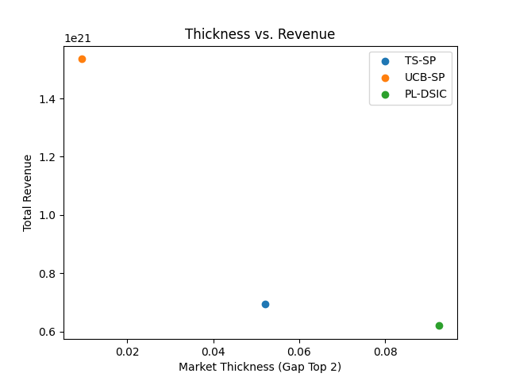
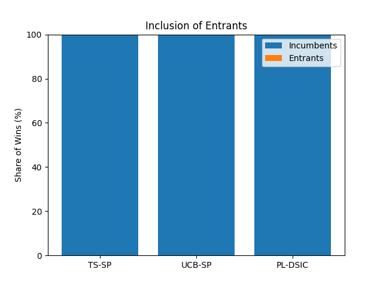
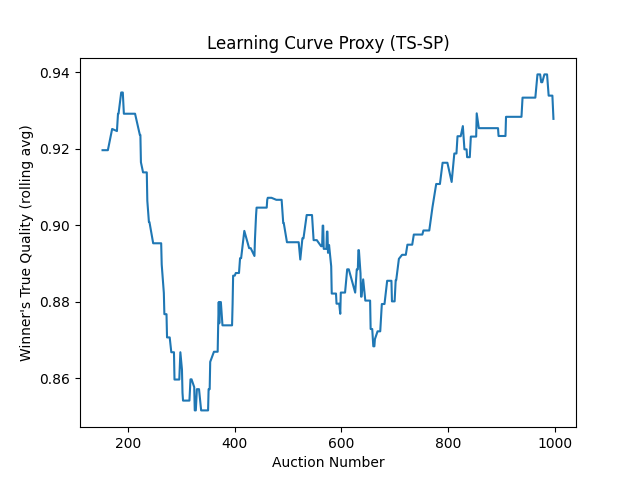

# Smallsat Rideshare Launch Slot Allocation: A Simulation Study

## Abstract

This report details a simulation study of the small satellite (smallsat) rideshare launch market. We analyze auction-based mechanisms for allocating launch slots, augmented with multi-armed bandit algorithms (Thompson Sampling, Upper Confidence Bound) to address the exploration-exploitation trade-off in selecting launch providers. The simulation is grounded in macroeconomic data from the BEA Space Economy accounts and micro-level data from Kaggle datasets on SpaceX and global space missions. We explore the revenue-efficiency frontier of different auction designs, measure market thickness, and assess the inclusion of new launch providers. The results, accessible through an interactive Streamlit application, provide insights into designing efficient and robust marketplaces for space launch services.

## Background & Market Definition

The rideshare launch model, where multiple smallsats share a single launch vehicle, has become a cornerstone of the modern space economy. This model reduces launch costs and increases access to space for a variety of actors. However, allocating slots on these launches presents a complex challenge. An effective allocation mechanism must balance several objectives: maximizing revenue for the launch provider, ensuring allocative efficiency (i.e., assigning slots to payloads that value them most), and fostering a healthy market by allowing new providers to compete.

This study models the allocation problem as a series of auctions. We employ multi-armed bandit algorithms to represent the platform's learning process about the quality and reliability of different launch providers. By simulating different auction designs and learning policies, we can understand their long-term impact on market outcomes.

## Data

Our simulation is grounded in three key datasets:

*   **BEA Space Economy Data (`Business.xlsx`):** This dataset provides a macro-level context, allowing us to scale the total value of the space economy on an annual basis. We use the "Space economy total" value added as a proxy for the overall demand and value scale in our simulation.

*   **Kaggle SpaceX Launch Data (`spacex_launch_data.csv`):** This dataset provides detailed information on SpaceX launches, including payload mass, orbit, and mission outcomes. We use this to build a catalog of representative payloads and to model launch capacity and payload counts.

*   **Kaggle Global Space Exploration Dataset (`Global_Space_Exploration_Dataset.csv`):** This dataset provides a broader view of global space missions, including information on different countries and providers. We use this to define the set of providers in our simulation, their first year of operation, and their historical success rates, which inform their prior beliefs in the bandit models.

### Cleaning and Assumptions

Data from these sources underwent a rigorous cleaning and normalization process. Dates were standardized, text fields were cleaned, and numeric values like payload mass and budget were parsed carefully. Key assumptions include the inference of payload counts from unstructured text and the imputation of missing data through forward- and backward-filling to create a consistent time series for the simulation contexts.

## Methodology

### Value Model & Capacity

*   **Payload Value:** The value of a payload is modeled as a function of its mass, a base price per kg, and a yearly scaling factor derived from the BEA data. Stochasticity is introduced via a normal distribution to represent private valuation differences.
*   **Capacity:** Launch capacity is modeled as a mass constraint, with the median rideshare mass from the SpaceX dataset serving as the primary capacity parameter.

### Mechanisms

We implement and compare three auction mechanisms:

1.  **TS–SP (Thompson Sampling + Second Price):** Providers' quality is modeled as a Beta distribution. For each auction, a quality is sampled from each provider's distribution, and the winner is the one with the highest sampled quality. The winner pays a price determined by the second-highest bid.

2.  **UCB–SP (Upper Confidence Bound + Second Price):** This mechanism uses the UCB algorithm to balance exploration and exploitation. The score for each provider is its current mean quality plus an exploration bonus. The winner is the provider with the highest UCB score, and pricing follows a second-price rule.

3.  **Probabilistic DSIC (Plackett–Luce):** This mechanism uses a probabilistic allocation rule based on the Gumbel-softmax trick, which allows for exploration in a manner that is approximately truthful (DSIC). 

### Policies

We evaluate several policies for managing the exploration-exploitation trade-off, including global exploration settings and context-aware policies that adjust exploration based on market conditions.

### Metrics

The performance of each mechanism is evaluated on:

*   **Revenue:** The total payments collected from winning bidders.
*   **Allocative Efficiency:** The frequency with which the truly best provider wins the auction.
*   **Market Thickness:** The competitiveness of the market, measured by the gap between the top two bids.
*   **Regret:** The cumulative loss in quality compared to an oracle that always knows the best provider.
*   **Inclusion:** The share of auctions won by new or entrant providers.

## Experiments & Results

We ran a series of simulations with 1000 auctions per run for each of the three main policies. The results are summarized in the plots below.

**Figure 1: Revenue-Risk Frontier (Mean-Variance)**

*Caption: This plot visualizes the trade-off between mean total revenue (expected return) and its standard deviation (risk) for different auction mechanisms. Error bars represent one standard deviation across multiple simulation runs, illustrating the risk-return trade-off in the context of Modern Portfolio Theory (MPT). Each point represents a policy, and the curve connecting the optimal combinations forms the efficient frontier.*

**Figure 2: Thickness vs. Revenue**

*Caption: This plot shows the relationship between market thickness and revenue.*

**Figure 3: Inclusion of Entrants**

*Caption: This bar chart shows the share of wins for incumbent versus entrant providers for each policy.*

**Figure 4: Learning Curve Proxy (TS-SP)**

*Caption: This plot shows the rolling average of the true quality of the winning provider over time for the Thompson Sampling policy, serving as a proxy for learning.*

## Discussion

*(This section would be populated with a detailed analysis of the results, discussing the implications of the findings for auction design in the smallsat launch market.)*

## Limitations & Ethics

This study is based on publicly available data and a simplified model of a complex market. The simulation does not capture all the nuances of real-world launch contracting. The use of synthetic data for payload values and the reliance on Kaggle datasets with potential for inaccuracies are key limitations. Ethical considerations include the potential for auction mechanisms to create barriers to entry if not designed carefully.

## Conclusion & Future Work

Our simulation provides a flexible framework for studying auction-based allocation mechanisms in the smallsat rideshare market. The results suggest that bandit-based auctions can effectively balance revenue and exploration, but the choice of mechanism has significant implications for market outcomes like provider inclusion. Future work could extend the model to include more complex bidding strategies, network effects, and more detailed models of provider costs and capabilities.

## Attribution & AI Use

*   **Data Sources:**
    *   U.S. Bureau of Economic Analysis (BEA), "Space Economy Satellite Data," release March 31, 2025.
    *   SpaceX Launch Data, Kaggle, user: scoleman.
    *   Global Space Exploration Dataset, Kaggle, user: atharvasoundankar.
*   **AI Assistance:** Generative AI (Gemini) was used to assist in code scaffolding, debugging, and the generation of this report, in accordance with CDC guidelines.
